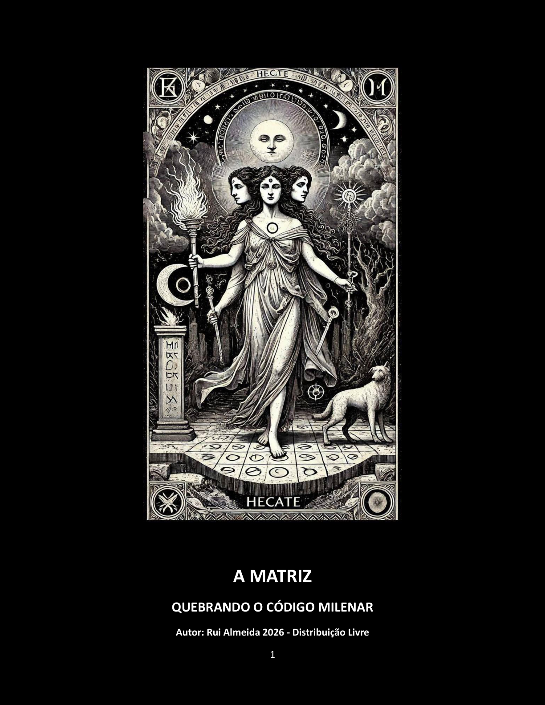

# THE MATRIX — BREAKING THE MILLENNIAL CODE

## A MATRIZ — QUEBRANDO O CÓDIGO MILENAR

**Author / Autor:** Rui Almeida

**Publisher / Editora:** Lulu, 2026

**Length / Extensão:** 751 pages / páginas

# ISBN 978-1-291-88363-3

## Editions and links / Edições e ligações

- **Amazon — printing cost, zero profit / preço de impressão, lucro zero:** [Portuguese edition / Edição portuguesa](https://www.amazon.com.br/MATRIZ-QUEBRANDO-C%C3%93DIGO-MILENAR-ebook/dp/B0GFY26FF9)
- **Lulu — printing cost, zero profit / preço de impressão, lucro zero:** [Find the book by ISBN / Encontrar o livro pelo ISBN](https://www.lulu.com/search?adult_audience_rating=00&page=1&pageSize=10&q=9781291883633)
- **Internet Archive — Português:** [A Matriz — Quebrando o Código Milenar](https://archive.org/details/matriz-quebrando-o-co-digo-milenar-distribuicao-gratuita)
- **Internet Archive — English:** [The Matrix — Breaking the Millennial Code](https://archive.org/details/the-matrix-breaking-the-millennial-code-en-us)
- **Read online / Ler online:** [Public English edition / Edição pública inglesa](https://www.scribd.com/document/980474821/THE-MATRIX-BREAKING-THE-MILLENNIAL-CODE-en)

The Portuguese and English printed editions are made available at the cost of printing. The author receives no profit from these sales.

As edições impressas portuguesa e inglesa são disponibilizadas ao preço de custo da impressão. O autor não recebe qualquer lucro destas vendas.

---

## Português — primeiras duas páginas de texto

### DEDICATÓRIA

#### Aos espíritos livres.

Àqueles que recusam seguir o rebanho e ousam questionar narrativas herdadas.

Àqueles que valorizam a verdade histórica acima do conforto da crença conveniente.

Àqueles que entendem que espírito crítico não é cinismo — é coragem.

Este livro é o resultado de uma profunda pesquisa em factos históricos verificáveis:

Manuscritos antigos, registos eclesiásticos, textos herméticos traduzidos, documentação da Inquisição, cronologias arqueológicas.

Nada aqui é especulação. Tudo pode ser confirmado.

A verdade não precisa de fé. Precisa de investigação.

Dedico este trabalho ao meu filho, Diogo Alexandre Almeida.

Que nunca aceites respostas prontas.

Que sempre procures as fontes.

Que nunca permitas que te roubem o direito de pensar por ti próprio.

A maior herança que te posso deixar não são respostas — é a capacidade de fazeres as perguntas certas.

Este livro é a prova de que a verdade sempre sobrevive, mesmo quando enterrada durante séculos.

… E que quando finalmente vem à luz, nenhuma instituição pode apagá-la novamente.

Que possas caminhar sempre sem correntes.

### Nota do Autor

E se tudo o que te ensinaram sobre espiritualidade fosse uma mentira cuidadosamente construída?

Este livro não é ficção. É um estudo histórico rigoroso baseado em documentação verificável: Corpus Hermeticum, textos gnósticos, manuscritos de Nag Hammadi, obras de Platão, registos da Inquisição e arquivos eclesiásticos.

Durante 1700 anos, a Igreja Católica (e não só) apropriou-se de festivais pagãos (Natal = Solstício de Inverno, Páscoa = Equinócio da Primavera), queimou bibliotecas inteiras (Alexandria, 391 d.C.), assassinou guardiães do conhecimento (Hipátia, 415 d.C.) e destruiu tradições espirituais autênticas que precediam o cristianismo em milénios.

Hermetismo, Gnosticismo, Mistérios de Elêusis — sabedorias milenares que ensinavam acesso direto ao divino foram sistematicamente apagadas. Porquê? Porque conhecimento que liberta é perigoso para quem quer controlar.

“A Matriz – QUEBRANDO O CODIGO MILENAR” expõe, com datas e factos, como te baptizaram sem consentimento, roubaram o teu calendário, instalaram culpa como controlo psicológico e venderam-te salvação que nunca precisaste comprar.

Da Babilónia ao Vaticano, do Livro dos Mortos aos impostos modernos, este livro traça 3500 anos de manipulação institucional — e mostra-te como sair dela.

Deus não precisa de intermediários. Nunca precisou.

A revolução começa quando desaprendes a mentira.

---

## English — first two text pages

### DEDICATION

#### To free spirits.

To those who refuse to follow the herd and dare to question inherited narratives.

To those who value historical truth above the comfort of convenient belief.

To those who understand that critical thinking is not cynicism — it is courage.

This book is the result of in-depth research into verifiable historical facts: ancient manuscripts, ecclesiastical records, translated hermetic texts, Inquisition documentation, archaeological chronologies.

Nothing here is speculation. Everything can be confirmed.

Truth does not require faith. It requires investigation.

I dedicate this work to my son, Diogo Alexandre Almeida.

Never accept ready-made answers.

Always look for the sources.

May you never allow anyone to steal your right to think for yourself.

The greatest legacy I can leave you is not answers—it is the ability to ask the right questions.

This book is proof that the truth always survives, even when buried for centuries.

... And that when it finally comes to light, no institution can erase it again.

May you always walk without chains.

### Author's Note

What if everything you were taught about spirituality was a carefully constructed lie?

This book is not fiction. It is a rigorous historical study based on verifiable documentation: Corpus Hermeticum, Gnostic texts, Nag Hammadi manuscripts, works by Plato, records of the Inquisition, and ecclesiastical archives.

For 1,700 years, the Catholic Church (and others) appropriated pagan festivals (Christmas = Winter Solstice, Easter = Spring Equinox), burned entire libraries (Alexandria, 391 AD), murdered guardians of knowledge (Hypatia, 415 AD), and destroyed authentic spiritual traditions that predated Christianity by millennia.

Hermeticism, Gnosticism, Eleusinian Mysteries — ancient wisdoms that taught direct access to the divine were systematically erased. Why? Because knowledge that liberates is dangerous to those who want to control.

“The Matrix — BREAKING THE MILLENNIAL CODE” exposes, with dates and facts, how they baptized you without your consent, stole your calendar, installed guilt as psychological control, and sold you salvation you never needed to buy.

From Babylon to the Vatican, from the Book of the Dead to modern taxes, this book traces 3,500 years of institutional manipulation—and shows you how to break free from it.

God does not need intermediaries. He never has.

The revolution begins when you unlearn the lie.

---

## Permission and restrictions / Autorização e restrições

© 2026 Rui Almeida. All rights reserved except for the express permissions below.

Free copying, sharing, distribution and printing of this unaltered material are expressly authorized. Attribution to Rui Almeida and preservation of ISBN **978-1-291-88363-3** are required. Alteration, adaptation, distortion, sale, commercialization or any use for profit are prohibited. Unauthorized use may result in legal action and the consequences provided by applicable law.

© 2026 Rui Almeida. Todos os direitos reservados, exceto nas autorizações expressas abaixo.

É expressamente autorizada a cópia, partilha, distribuição e impressão gratuitas deste material sem alterações. É obrigatória a atribuição a Rui Almeida e a preservação do ISBN **978-1-291-88363-3**. São proibidas a alteração, adaptação, adulteração, venda, comercialização ou qualquer utilização com fins lucrativos. A utilização não autorizada poderá resultar em medidas legais e nas consequências previstas pela legislação aplicável.
