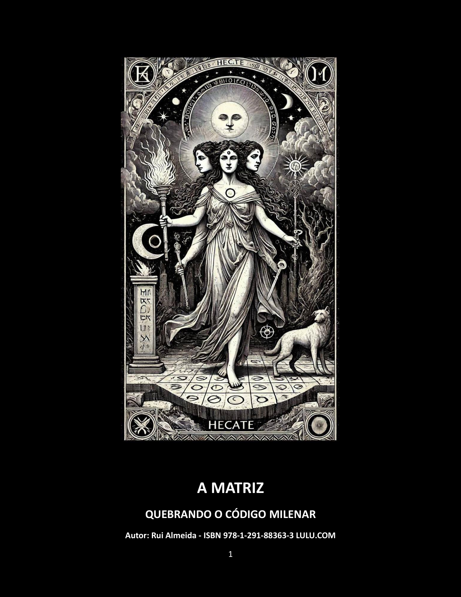

# A MATRIZ

## QUEBRANDO O CÓDIGO MILENAR

**Autor:** Rui Almeida

**ISBN:** 978-1-291-88363-3

**Editora:** Lulu, 2026

**Extensão:** 751 páginas

**Ler online:** [A edição pública do livro no Scribd](https://www.scribd.com/document/980474821/THE-MATRIX-BREAKING-THE-MILLENNIAL-CODE-en)

**Autor no Goodreads:** [Rui Almeida](https://www.goodreads.com/author/show/7714837.Rui_Almeida)

---

## DEDICATÓRIA

### Aos espíritos livres.

Àqueles que recusam seguir o rebanho e ousam questionar narrativas herdadas.

Àqueles que valorizam a verdade histórica acima do conforto da crença conveniente.

Àqueles que entendem que espírito crítico não é cinismo — é coragem.

---

Este livro é o resultado de uma profunda pesquisa em factos históricos verificáveis:

Manuscritos antigos, registos eclesiásticos, textos herméticos traduzidos, documentação da Inquisição, cronologias arqueológicas.

Nada aqui é especulação. Tudo pode ser confirmado.

A verdade não precisa de fé. Precisa de investigação.

---

Dedico este trabalho ao meu filho, Diogo Alexandre Almeida.

Que nunca aceites respostas prontas.

Que sempre procures as fontes.

Que nunca permitas que te roubem o direito de pensar por ti próprio.

A maior herança que te posso deixar não são respostas — é a capacidade de fazeres as perguntas certas.

Este livro é a prova de que a verdade sempre sobrevive, mesmo quando enterrada durante séculos.

… E que quando finalmente vem à luz, nenhuma instituição pode apagá-la novamente.

Que possas caminhar sempre sem correntes.

---

## Nota do Autor

E se tudo o que te ensinaram sobre espiritualidade fosse uma mentira cuidadosamente construída?

Este livro não é ficção. É um estudo histórico rigoroso baseado em documentação verificável: Corpus Hermeticum, textos gnósticos, manuscritos de Nag Hammadi, obras de Platão, registos da Inquisição e arquivos eclesiásticos.

Durante 1700 anos, a Igreja Católica (e não só) apropriou-se de festivais pagãos (Natal = Solstício de Inverno, Páscoa = Equinócio da Primavera), queimou bibliotecas inteiras (Alexandria, 391 d.C.), assassinou guardiães do conhecimento (Hipátia, 415 d.C.) e destruiu tradições espirituais autênticas que precediam o cristianismo em milénios.

Hermetismo, Gnosticismo, Mistérios de Elêusis — sabedorias milenares que ensinavam acesso direto ao divino foram sistematicamente apagadas. Porquê? Porque conhecimento que liberta é perigoso para quem quer controlar.

“A Matriz – QUEBRANDO O CODIGO MILENAR” expõe, com datas e factos, como te baptizaram sem consentimento, roubaram o teu calendário, instalaram culpa como controlo psicológico e venderam-te salvação que nunca precisaste comprar.

Da Babilónia ao Vaticano, do Livro dos Mortos aos impostos modernos, este livro traça 3500 anos de manipulação institucional — e mostra-te como sair dela.

Deus não precisa de intermediários. Nunca precisou.

A revolução começa quando desaprendes a mentira.

---

© 2026 Rui Almeida. Todos os direitos reservados. Este excerto é publicado com autorização do autor.
